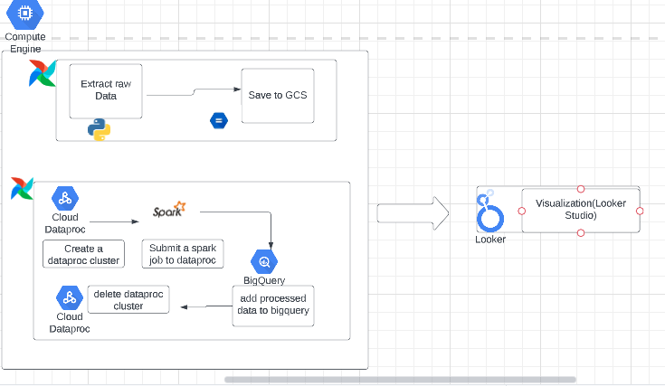
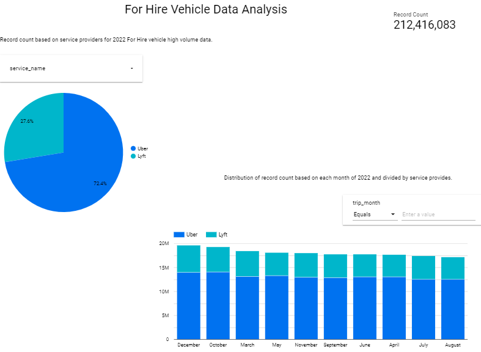

# For Hire Vehicle Data Analysis: Data Engineerin Project
This repo contains the final project implemented for the [Data Engineering zoomcamp](https://github.com/DataTalksClub/data-engineering-zoomcamp) course.

## Introduction
The aim of this project is to analyse the hire-taxi data in newy york city for 2022. The project is developed intended to analyse the FHV(For hi
re-vehicle) data and to get the answer of few questions as below:
1) Different providers offering services in tax-hiring and their market share?
2) Distribution of taxi hiring based on each month of 2022 and drill down based on service providers?


## Dataset
The [NYC Taxi For Hire Vehicle(FHV) Data](https://www.nyc.gov/site/tlc/about/tlc-trip-record-data.page) dataset is used. This dataset is updated monthly.

Details include information about the time, location and descriptive categorizations of the trip records for FHV taxi high volume data. To know more about the dataset click [Here](https://www.nyc.gov/assets/tlc/downloads/pdf/data_dictionary_trip_records_hvfhs.pdf).

## Tools

The following components were utilized to implement the required solution:
* Data Ingestion: Data extracted using python requests module using [NYC Taxi data internal API](https://d37ci6vzurychx.cloudfront.net/trip-data/fhvhv_tripdata_2022-01.parquet)
* Infrastructure as Code: Terraform
* Workflow orchestration: Airflow
* Data Lake: Google Cloud Storage
* Data Warehouse: Google BigQuery
* Data Transformation: Spark via Google Dataproc
* Reporting: Google Looker Studio

### Architecture


## Reproduce

### Local setup
* Install the below tools:
  * [Terraform](https://www.terraform.io/downloads)
  * [Google Cloud SDK](https://cloud.google.com/sdk/docs/install-sdk#deb)
  * docker + docker-compose v2
  
### Cloud setup
* In GCP, create a service principal with the following permissions:
  * BigQuery Admin
  * Storage Admin
  * Storage Object Admin
  * Dataproc Admin
* Download the service principal authentication file and save it as `$HOME/.google/credentials/google_credentials_project.json`.

* Ensure that the following APIs are enabled:
  * Compute Engine API
  * Cloud Dataproc API
  * Cloud Dataproc Control API
  * BigQuery API
  * Bigquery Storage API
  * Identity and Access Management (IAM) API
  * IAM Service Account Credentials API
  
 
### Initializing Infrastructure (Terraform)

* Perform the following to set up the required cloud infrastructure
```shell
cd terraform
terraform init
terraform plan
terraform apply

cd ..
```
### Data Ingestion

* Setup airflow to perform data ingestion
```shell
cd airflow

docker-compose build
docker-compose up airflow-init
docker-compose up -d
```

* Go to the aiflow UI at the web address `localhost:8080` and enable the `FHVHV_DATA_ETL` dag. 
* This dag will ingest the month wise FHVHV data for year 2022, upload it to the data lake(GCS).

### Data Transformation
* Install and setup spark [Follow this](https://github.com/Rohitjoshi07/FHVDataAnalysis/blob/main/sparkInstallation.md). 

* Enable and run the `Spark_FHVHV_ETL` dag.
* This will intialize the below steps:
    * Create a Dataproc cluster.
    * Submit a spark code to GCS.
    * submit a spark job to Dataproc for transformation and analysis and save processed data to GCS after partitioning.
    * Save the processed data from GCS to BigQuery with clustering data based on month.
    * Delete the DataProc cluster.
    

## Dashboard



It can also be viewed at this [link](https://lookerstudio.google.com/s/tslbaH39mBY).
